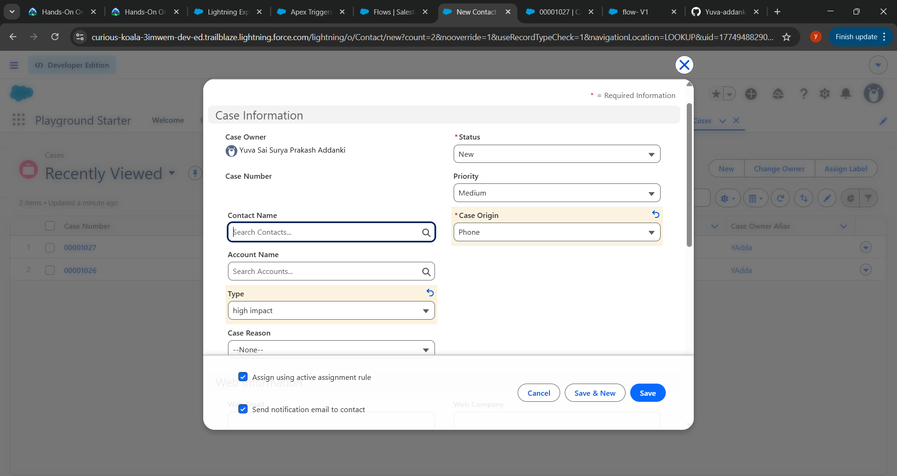
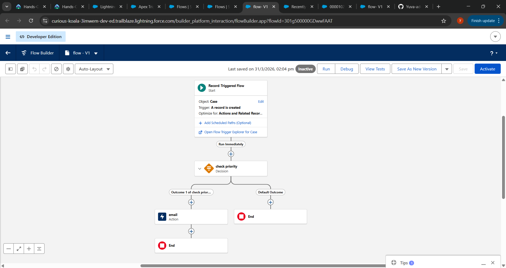
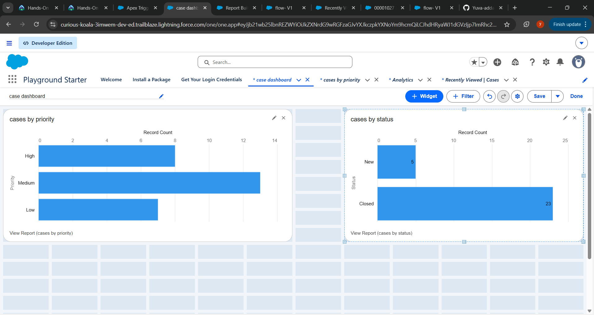

# Smart Complaint Management System (Salesforce) 🚀

## 📌 Overview
Developed a Salesforce-based Case Management System to automate and streamline complaint handling using Apex, Flow, and Assignment Rules.

## ⚙️ Features
- 📄 Case creation and tracking
- ⚡ Automatic priority assignment using Apex Trigger
- 📧 Email notifications using Salesforce Flow
- 👤 Automatic case assignment using Assignment Rules
- 📊 Reports and Dashboards for real-time analytics

## 🛠️ Technologies Used
- Apex
- SOQL
- Salesforce Flow
- Reports & Dashboards

## 🔄 Project Workflow
Customer → Case Created → Priority Assigned → Case Assigned → Email Notification Sent → Dashboard Updated

## 📸 Screenshots

### Case Creation

### Flow Automation

### Dashboard

## 📈 Outcome
- Reduced manual effort through automation
- Improved case handling efficiency
- Ensured faster response for high-priority cases

## 👨‍💻 Author
Yuva Sai Surya Prakash Addanki
